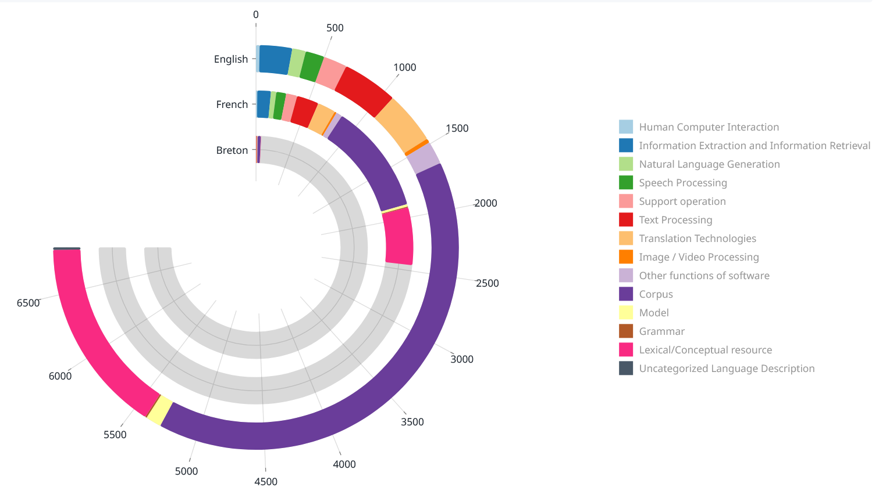

# Hackathon
SkipAIlh propose "skoazell slide"
Moteur de création de matériel pédagogique (diapos) dans une langue sous-dotée (breton).


## Vendre le système

### Motivation:


- Aide à l'enseignement d'une langue sous-dotée, selon ELG dasboard; 04/09/2025 : 

- Augmenter le corpus disponible par récupération de texte de qualité 
- Faciliter les contributions Wikipédia en breton
- Faire un essai pilote avec Mistral medium (finalement pas [Apertus 8B](https://huggingface.co/swiss-ai/Apertus-8B-Instruct-2509) "1811 natively supported languages")

### Déontologie (D'abord ne pas nuire)
- Désirabilité des outils numériques établie ([Plan de réappropriation des langues de Bretagne 2024-2027](https://kevrebreizh.bzh/wp-content/FileManager/_DocsPublics/Conventions%20et%20textes%20officiels/Rannvro%20Breizh%20-%20R%C3%A9jion%20Bert%C3%A8gne%20-%20R%C3%A9gion%20Bretagne/Convention%20Langues%20de%20Bretagne/Plan_reappropriation_Langues_bzh.pdf); avalisé par le [Conseil culturel de Bretagne; 2 décembre 2023](https://www.bretagne.bzh/app/uploads/CONSEIL_CULTUREL_Avis_langues_2023_12_02.pdf))
- Entrée avec consentement explicite
- Réduction d'écart numérique entre langues en bilinguisme (présupposé d'acculturation à l'outil > bas impact sur les usages culturels)
- Pas de pollution linguistique en breton cassé: l'outil s'adresse explicitement en breton aux enseignant.es brittophones
- Pas de concurrence financière avec nos utilisateurs: hors circuit de financement public (Région, Département)
- Soutien dev, promotion sociale et maintien pressenti > fond de dotation Breizh Niverel, dans le cadre de [leur campagne de contributions wiki](https://bretagnenumerique.bzh/projets/wikipedia/)

### Explication du système (Comment ça marche ?)

- Ce que fait le système maintenant ?
- Prendre des requêtes comme
      - "To pa ri ti" (variante de [Pa ri ti to](https://br.wikipedia.org/wiki/To_pa_ri_ti), 'Vas au bout de tes projets')
      - "Pelec'h e vev ar c'hrokodiled ?" (p. [krokodil](https://br.wikipedia.org/wiki/Krokodil))

### Roadmap (Futures perspectives - Fonctionalités)

- Enrichir wikipedia avec un humain dans la boucle:
    - RI dans d'autres langues, avec un output trad à corriger (?) en syntaxe wiki pour produire des données pour enrichir les corpus. ("Da betra 'servij an tiegezh Abri du marin ?" 'A quoi ça sert un [Abri du marin](https://fr.wikipedia.org/wiki/Abri_du_marin) ?'). 
- Filtration
- Slides données par qqn d'autres
- Templating des slides:
    - Méta Rêquetes pour faire des slides.

## Lancer l'interface (Gradio)

Prérequis: Python 3.10+.

1. Installer les dépendances: `uv sync`
2. Démarrer l'app: `uv run main.py`
3. Ouvrir l'URL locale affichée pour utiliser l'éditeur de diapositives.

Fonctions clés:
- Panneau gauche: liste des slides, bouton ➕ pour ajouter, bouton «Save All» pour télécharger une archive `.zip` de toutes les diapositives.
- Panneau droit: champs «Title» et «Content (Markdown)», aperçu en direct, «Save» pour mémoriser la diapositive sélectionnée, «Download» pour exporter la diapositive courante en `.md`.

### Charger des données JSON

Utiliser le champ «Load JSON» pour importer un fichier `.json` au format:

```json
{"query": "Breizh", "md_text": "## HERE THE MARKDOWN TEXT", "Metadata": {"source": "..."}}
```

- `query` → titre de la diapositive
- `md_text` → contenu Markdown
- `Metadata` (optionnel) est stocké avec la diapositive et inclus dans `slides.json` lors de «Save All».

Le chargeur accepte aussi une liste de tels objets.
